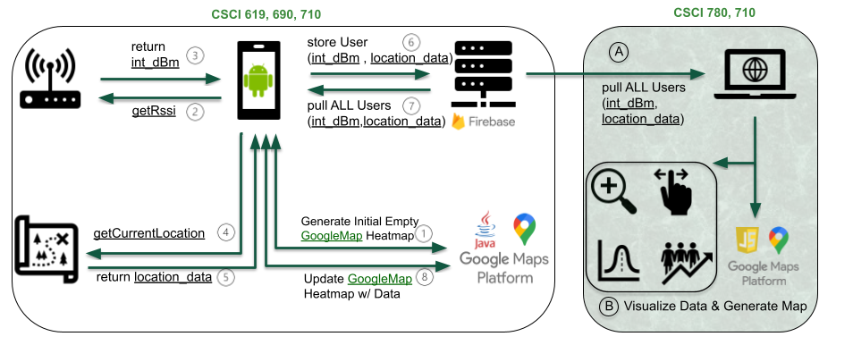

# RSSI Heatmap Visualization Tool: Anaximander 

Network users must have reliable connection quality to the local network infrastructure in order to meet the requirements of daily modern life. The Wi-Fi Received Signal Strength Indicator (RSSI) is the measurement of this connection quality between the user's device and network Access Point (AP). One problem is that currently it is difficult for users to locate physical area zones with strong or weak RSSI. This means that users are left with limited options when they find themselves in an area with a weak network connection. 

In order to mitigate this problem, we propose Anaximander, a novel end-to-end data collection and visualization pipeline that can take mobile phone sensor data as an input, and produce an output of informative heatmaps of RSSI over a traveled area. Anaximander uses crowdsourcing techniques in order to enable future scaling and deployment to student devices.

We have evaluated our tool by conducting three user interviews among graduate students. The initial results indicate that our tool is well received, and we highlighted many opportunities for future work.

# System Architecture

